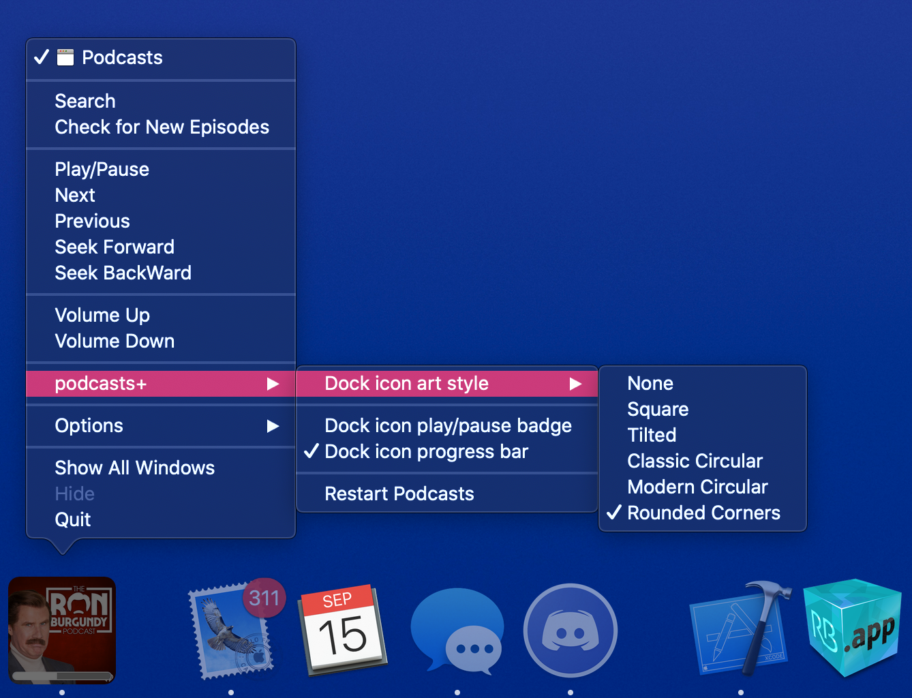

# podcastsPlus
MacForge plugin that adds a few cool features to the new Podcasts app on macOS 10.15

 

# Information:

- Designed for 10.15+ 
- Designed for Podcasts 1.0.0+  
- podcastsPlus is a MacForge plugin that adds some features to the Spotify desktop player
    - Change the dock icon to the now playing track art
    - Add progress bar to dock icon
    - Add Play/Pause, Next, Previous and Seek options to dock menu
    - Add Volume control to dock menu
    - Restart Podcasts
    - Settings in Dock menu and podcasts+ item in the menubar

# Installation:

1. Download [MacForge](https://github.com/w0lfschild/app_updates/raw/master/MacForge/MacForge.zip)
2. Search for podcasts+ in MacForge
3. Click `GET`
4. Open the Podcasts app

### License:
Pretty much the BSD license, just don't repackage it and call it your own please!    
Also if you do make some changes, feel free to make a pull request and help make things more awesome!
